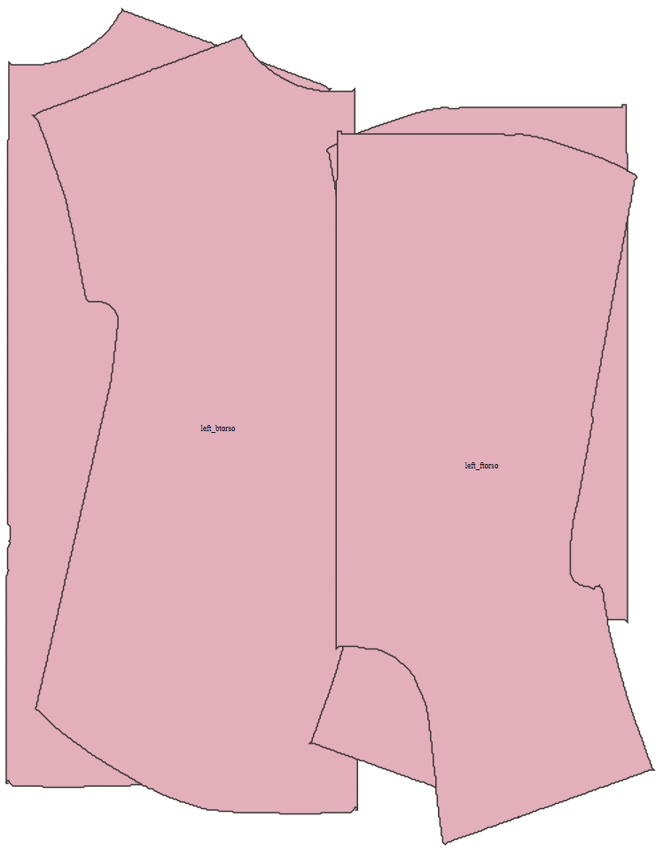
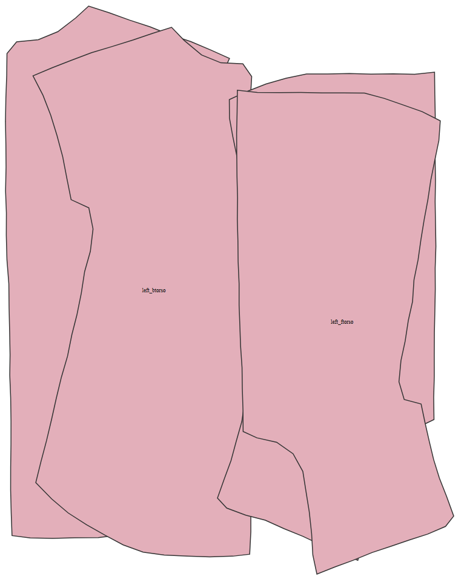
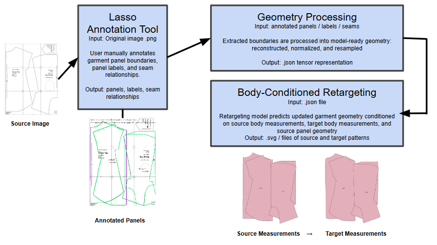

# Sewing Pattern Extraction and Retargeting

<p align="center">
  
</p>

Resizing sewing patterns for different body measurements is a largely manual process that requires specialized drafting knowledge and significant effort. Existing resizing methods work for standardized garments, but they struggle to preserve stylistic or aesthetic features. This project introduces a prototype pipeline that combines interactive sewing pattern extraction with machine learning-based garment retargeting to convert pattern images into body shape-specific geometry. By integrating panel annotations with learned geometric transformations, the system can preserve more of the original garment structure while adapting patterns to new body measurements. 

## Usage

Install all dependencies by running: 
```
$ pip3 install -r requirements.txt
```
Convert an input pattern (in .png format) into the .json format the resizing model expects. Run this command from the root: 
```
$ python3 src/project/pattern_lasso_v2.py
```
This command opens your files, alternatively move an image file into your root repo and run the following command: 
```
$ python3 src/project/pattern_lasso_v2.py image.png
```
This command launches a window that allows you to manually annotate where the edges in the pattern are. The animated gif below shows the tool in action: 

<p align="center">
  
</p>

The output file is saved to a `output.json` format. 

More information on how to use the panel selection tool can be found at `src/projects/README.md`.

The last step is to pass this to our model. From the root repo, run: 
```
$ src/projects/panel_mapping/run_lasso_to_model.sh \
  pattern_project.json \
  source_measurements.yaml \
  target_measurements.yaml \
  checkpoint.pt \
  output_dir
```
The command above generates a new pattern shown below: 

.svg-formatted source pattern:



.svg-formatted target pattern: 




## How it Works

<p align="center">
  
</p>

The pipeline combines interactive pattern annotation with a neural garment retargeting model. 

### Pattern Extraction: 

A sewing pattern image is loaded into the lasso annotation tool. The user manually traces each garment panel using an edge-snapping lasso tool. During annotation, the user: 

- Marks and extracts panel boundaries
- Assigns panel labels 
- Marks seam relationships between edges
- Exports the garment into a structured JSON format

Example panel labels: 

```text
left_ftorso
right_ftorso
left_btorso
right_btorso
left_sleeve_f
```
### Geometry Processing: 

The extracted panel boundaries are converted into model-ready geometry. Each garment panel boundary is reconstructed from polylines, normalized into a shared coordinate space, and resampled into a fixed-length polygon representation. 

The current model represents each panel as a fixed number of ordered boundary points. This produces a tensor representation that can be processed by the neural network regardless of the original panel complexity. 

### Body-Shape Retargeting

The retargeting model predicts updated garment geometry conditioned on source body measurements, target body measurements, source garment panel geometry. The current implementation uses a neural network traned on garment and body data derived from the GarmentCode framework. 

The model learns the geometric relationships between body proportions and garment panel shape. During inference, the model predicts updated panel vertex positions corresponding to the target body measurements. To stabilize outputs for real sewing patterns, the current prototype applies very slight blending between the original extracted geometry and the predicted geometry. This helpes preserve stylistic characteristics from the original pattern while still applying transformations. 

### Structured Output 
The predicted garment is exported into structured JSON specifications and SVG visualizations. The SVG output can be viewed directly in a browser. 

### Dataset
This project uses garment geometry and body measurement data derived from the GarmentCode dataset and framework.

GarmentCode:
- https://github.com/maria-korosteleva/GarmentCode

If you use this repository for research purposes, please also cite the original GarmentCode work.

The machine learning models in this repository were trained on processed garment/body data generated from GarmentCode assets.

# Current Status

This repository is an active research prototype.

Current strengths:

- successful panel extraction from real sewing patterns
- semantic panel labeling workflow
- end-to-end lasso → model → SVG pipeline
- pretrained shirt and pants retargeting checkpoints

Current limitations:

- limited training distribution
- training data limited in structure -- only allows 4 torso panels for a shirt, for example
- partial support for complex garment details
- no final sewing instruction generation yet

Patterns currently work best when they:

- use non-stretch woven fabrics
- contain relatively simple panel structures
- avoid highly decorative construction details such as pockets

